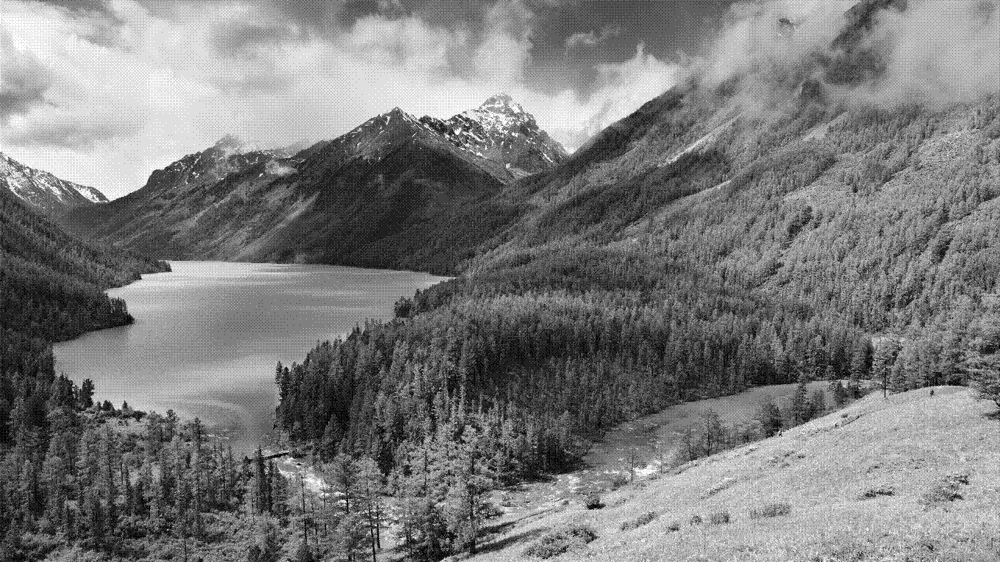

# Ordered Dithering

One way of minimizing the size of an image is to simply reduce the number of bits you use to represent each pixel. by default this number is 24 bits for RGB representation. You can reduce this number by quantization and reduce it to **1 bit** (black or white).

However this has its downside which is known as banding effect ([Wikipedia](https://en.wikipedia.org/wiki/Colour_banding)).
Ordered dithering is a technique in which we try to minimize this effect by distributing errors ([Wikipedia](https://en.wikipedia.org/wiki/Ordered_dithering)). There are also some other techniques like floyd-steinberg algorithm which works better but is slower than ordered dithering.

As an example consider the following image:

Now this is the gray scale version with size of **2.2M**:

But we can reduce the size to **204k** with ordered dithering:
